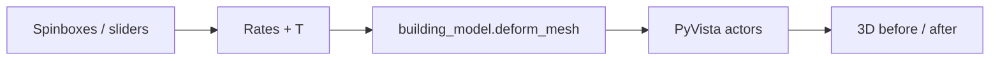

# Plan: High-Rise Building Settlement, Tilt & Shrinkage 3D Simulator

## Summary

Build a standalone Python application with an interactive GUI and a 3D view that shows a simple prismatic high-rise building **before** and **after** deformation over a user-selected time period. Deformation combines:

1. **Settlement** — uniform subsidence plus linear tilt (settlement gradients in **x** and **y**).
2. **Shrinkage** — horizontal contraction that increases linearly with elevation.

All kinematic inputs are **rates** (per year); total displacement at time `T` is `rate × T`. Default time period: **10 years**.

This is an educational/visualization tool (rigid-base prism, small-strain kinematics), not a structural FE model.

## Key Components Affected

| Item | Role |
|------|------|
| `tools/thermal_models/simulator_falk/` | Package directory for building simulator and related tools |
| `building_model.py` | Geometry, deformation math, mesh vertices |
| `gui_app.py` | Main entry: controls + 3D view |
| `requirements.txt` | Pin GUI/3D deps for this tool only |
| `architecture_docs/FILE_STRUCTURE.md` | Brief entry if we add the tool to the repo (optional, on approval) |

**Dependencies (proposed):**

- **PyVista** + **pyvistaqt** — fast 3D meshes, before/after overlays, orbit/zoom.
- **PySide6** (Qt6) — sliders, spin boxes, layout (pyvistaqt uses Qt).
- **NumPy** — vertex math.

Alternative (lighter, weaker 3D): Matplotlib `mplot3d` + `tkinter` — acceptable for MVP but poorer interaction; **PyVista recommended**.

## Deformation Model (Explicit)

### Coordinate system

- Origin at **south-west corner of footprint**, ground at **z = 0**.
- Footprint: `0 ≤ x ≤ Lx`, `0 ≤ y ≤ Ly`, height `0 ≤ z ≤ H`.
- Building = rectangular prism (12 edges, 6 faces); mesh as box or edge wireframe + semi-transparent faces.

### Inputs (rates → totals)

Let `T` = time period [years]. User supplies rates; code computes totals:

| GUI label | Symbol (rate) | Unit | Total at time T |
|-----------|---------------|------|-----------------|
| Uniform settlement rate | `s₀` | m/yr | `S₀ = s₀ · T` |
| Settlement gradient ∂w/∂x | `gₓ` | m/yr/m | tilt contributes `gₓ · x · T` |
| Settlement gradient ∂w/∂y | `gᵧ` | m/yr/m | `gᵧ · y · T` |
| Shrinkage rate | `α` | 1/(yr·m) | see below |

**Vertical displacement** at any point `(x, y, z)` (settlement independent of z for this model):

```text
w(x, y) = (s₀ + gₓ·x + gᵧ·y) · T
```

Deformed position:

```text
z' = z - w(x, y)
```

(Positive settlement rate = downward motion; documented in GUI help.)

**Horizontal shrinkage** (one parameter, linear in elevation):

```text
ε_h(z) = α · z · T        # dimensionless horizontal strain at height z
scale(z) = 1 - ε_h(z)     # clamp scale ≥ ε_min (e.g. 0.01) to avoid fold-over
x' = x_c + (x - x_c) · scale(z)
y' = y_c + (y - y_c) · scale(z)
```

Use footprint center `(x_c, y_c) = (Lx/2, Ly/2)` so shrinkage is symmetric about the building axis (reasonable default; note in GUI).

Combined deformed coordinates:

```text
(x', y', z') = (x_c + (x-x_c)·scale(z),  y_c + (y-y_c)·scale(z),  z - w(x,y))
```

**Before** mesh: original prism. **After** mesh: same topology, vertices transformed by the above.

### Defaults (GUI)

| Parameter | Default |
|-----------|---------|
| Footprint Lx | 40 m |
| Footprint Ly | 20 m |
| Height H | 200 m |
| Time period T | 10 yr |
| s₀ | 0.02 m/yr (example; tune in GUI) |
| gₓ, gᵧ | 0 m/yr/m |
| α | 1×10⁻⁶ 1/(yr·m) (example) |

Display **max settlement** at corners and **max horizontal strain at roof** in a read-only summary panel.

## GUI Layout (Interactive)

```
┌─────────────────────────────────────────────────────────────┐
│  [Controls panel]              │  [3D view - PyVista]        │
│  Geometry                      │  • Before: wireframe / blue  │
│    Lx, Ly, H (spinboxes)       │  • After:  wireframe / red   │
│  Time                          │  • Toggle layers, legend     │
│    T (years)                   │  • Orbit / zoom / reset cam  │
│  Settlement rates              │                            │
│    s₀, gₓ, gᵧ                  │                            │
│  Shrinkage rate                │                            │
│    α                           │                            │
│  [Update] or live on change    │                            │
│  Summary (computed totals)     │                            │
└─────────────────────────────────────────────────────────────┘
```

- **Live update** on value change (debounced ~100 ms) preferred over a single Update button.
- Validation: `Lx, Ly, H, T > 0`; `scale(z) > 0` at roof; show warning if invalid.
- **--help** via `argparse` for optional defaults file / opening fullscreen (CLI minimal).

## Action Items

- [ ] Approve dependency choice (PyVista + PySide6).
- [ ] Confirm sign convention (settlement positive = downward).
- [ ] Confirm shrinkage pivots about footprint center (vs corner).
- [ ] Implement `building_model.py` (box mesh, `deform_vertices`, summary stats).
- [ ] Implement `gui_app.py` (Qt layout, pyvistaqt embed, before/after actors).
- [ ] Add `requirements.txt` with pinned versions.
- [ ] Add unit tests for deformation math (corner settlements, roof scale).
- [ ] Manual smoke test: launch GUI, change tilt, verify roof plane tilts.
- [ ] Optional: short README in tool directory with install/run lines.

## Execution Plan (Detailed Change Instructions)

### 1. Directory and entry point

```
tools/thermal_models/simulator_falk/
  __init__.py
  building_model.py
  gui_app.py
  PLAN.md
  README.md
  requirements.txt
  tests/
    test_building_model.py
```

- `chmod +x gui_app.py`; shebang `#!/usr/bin/env python3`.
- Run: `python tools/thermal_models/simulator_falk/gui_app.py`

### 2. `building_model.py`

- `make_building_mesh(lx, ly, h, subdiv=1)` → PyVista `UnstructuredGrid` or `PolyData` box.
- `deform_mesh(mesh, rates, T, pivot="center")` → new mesh, deformed vertices.
- `settlement_m(x, y, s0, gx, gy, T)` and `horizontal_scale(z, alpha, T)`.
- `summary(lx, ly, h, rates, T)` → dict: corner settlements, roof strain, volume change approx (optional).

### 3. `gui_app.py`

- `QMainWindow` + splitter: left `QFormLayout` / `QDoubleSpinBox` for all parameters; right `QtInteractor` (pyvistaqt).
- Two actors: `before` (blue wireframe), `after` (red wireframe); optional light transparent faces.
- Connect `valueChanged` → recompute → `plotter.clear()` or update mesh in place.
- Menu: View → Reset camera; Help → formula summary.

### 4. Tests (`tools/thermal_models/simulator_falk/tests/test_building_model.py`)

- Uniform `s₀` only: all corners same `w`; roof still flat.
- `gₓ` only: `w` increases linearly with `x`; SW vs SE corner difference = `gₓ · Lx · T`.
- `α` only: ground unchanged; roof `scale = 1 - α·H·T`; center x unchanged.
- Combined: spot-check one vertex by hand.

### 5. Documentation

- `README.md`: install (`pip install -r requirements.txt`), model equations, screenshot placeholder.
- If merged into main repo docs: one row in `architecture_docs/FILE_STRUCTURE.md` under `tools/thermal_models/simulator_falk/`.

## Key Commands & Flows

```bash
# Create venv (recommended)
python3 -m venv .venv-simulator-falk
source .venv-simulator-falk/bin/activate
pip install -r tools/thermal_models/simulator_falk/requirements.txt

# Run GUI
python tools/thermal_models/simulator_falk/gui_app.py

# Tests
python -m unittest discover -s tools/thermal_models/simulator_falk/tests -v
```

**Data flow:**



## Out of Scope (v1)

- Soil–structure interaction, cracking, nonlinear materials.
- Importing real BIM/CAD footprints.
- Animation over time (only end state at selected `T`; can add later).
- Integration with MinSAR InSAR products (future: load observed rates from geodesy).

## Open Questions for You

1. **Settlement sign** — Positive rate = building moves **down**? (assumed yes)
2. **Shrinkage** — Scale about footprint **center** (as above) or fixed corner?
3. **Default rates** — Any preferred engineering defaults (mm/yr, μstrain/yr)?
4. **Visualization** — Wireframe only, or wireframe + translucent solid faces?

## TODO List

- [ ] Human approval of this plan
- [ ] Answer open questions
- [ ] Write tests for deformation math
- [ ] Implement model + GUI
- [ ] Run tests and manual GUI check
- [ ] Update docs if tool is kept in repo
